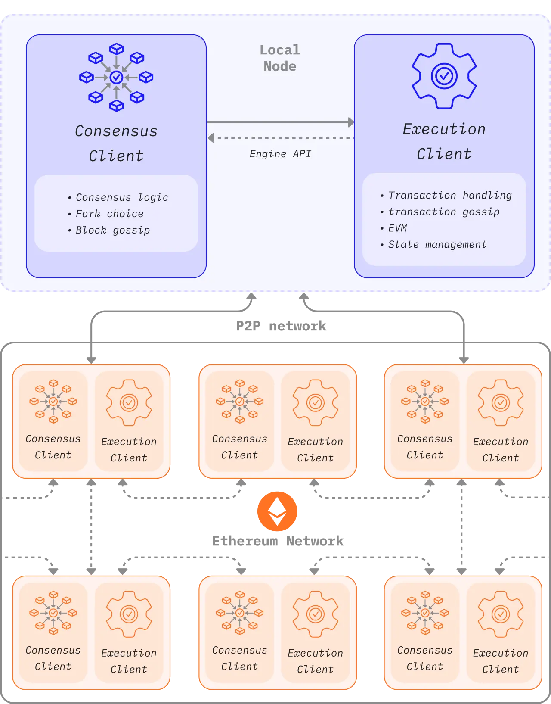

我为什么要决定自己部署一个节点
其实很简单
> 希望自己能够真正了解以太坊，打开这个黑箱。

这种感觉，让我想到了家里的车在汽修厂维修时，当汽车被吊起来，我有机会去观察每一个细节，底盘装甲，油箱，缓震，传动轴……

而结果证明，部署一个节点真的让我认识到非常多，以太坊的共识层、执行层架构，EVM，以太坊的网络堆栈，以太坊的数据结构（MPT），加密算法

还有硬件配置，linux使用（用户权限，文件系统，服务管理），docker使用，frp内网穿透

这段经历于我而言意义非凡，让我从一个观望者，初级开发者转变为一个深入了解以太坊细节，甚至有机会推动以太坊前进的建设者

在正式开始讲全节点部署之前，我们先简单讲讲什么事全节点以及它可以做什么！
## 什么是以太坊节点
以太坊是一个分布式的`世界计算机`，也是一个分布式的``状态机``，而这，都是由分布在全世界的节点共同努力维护的（每个节点都会在本地存储世界状态）。如果感兴趣，你可以看看全世界[以太坊节点的分布](https://etherscan.io/nodetracker)，相信我，你一定会被惊讶到😄

## 以太坊节点会做些什么
这里先不讲的过于细节，我们就从这两个视角
首先，以太坊是一张巨大的`p2p网络`。节点通过这张网络实现通信，这里面就涉及到节点通信，数据传输

其次，以太坊的每一个节点都是`执行单元`，我们刚刚说到以太坊是一个分布式的状态机，所以节点非常重要的作用就是执行交易，更新状态

## 以太坊节点的结构
以太坊的节点分为共识层和执行层，从字面上大家应该就可以理解意思，这张图片来自[以太坊官方文档](https://ethereum.org/zh/developers/docs/nodes-and-clients/node-architecture/)，如果想进一步了解也可以这个网站浏览

简单解读一下吧！
一个完整的节点由共识层和执行层组成，两层通过engine api进行通信，以太坊的每一个节点都是这样的架构，他们彼此间通过p2p网络实现通信

## 总结
在对以太坊全节点有了初步认识后，我们就开始进入下一章———硬件篇！

## 参考资料
[https://ethereum.org/zh/developers/docs/nodes-and-clients/run-a-node/](https://ethereum.org/zh/developers/docs/nodes-and-clients/run-a-node/)